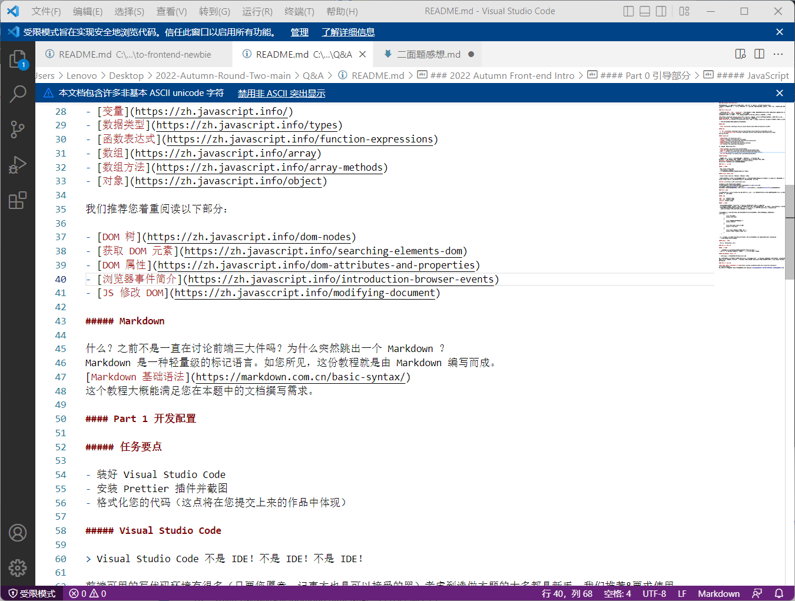
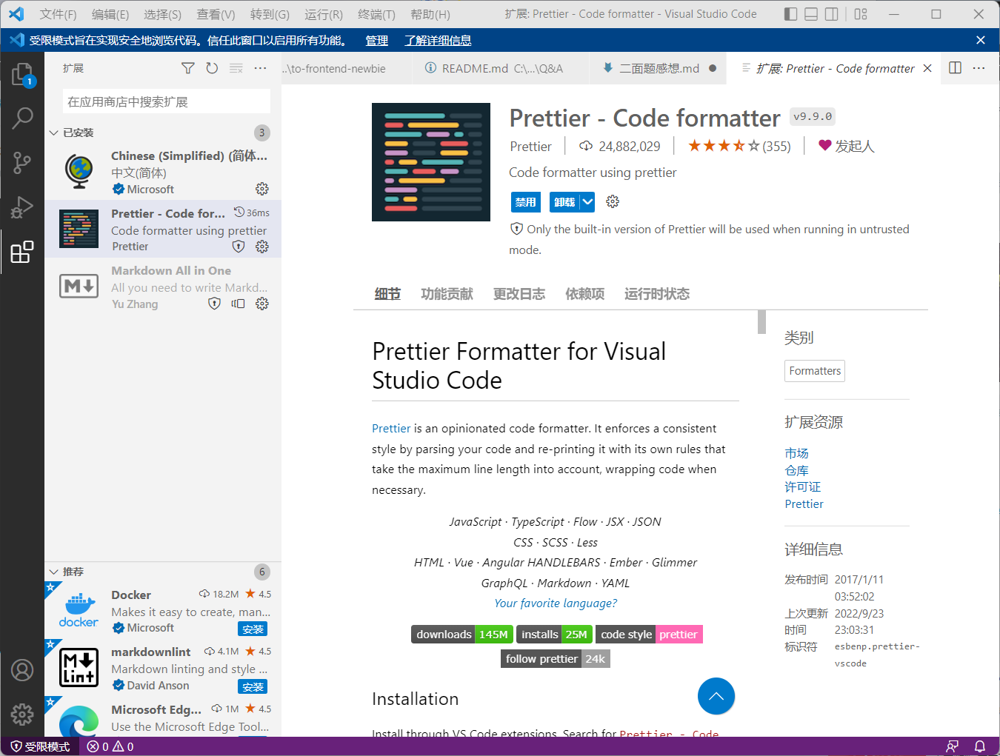

# 二面题作答感想

### 任务要点截图

  

## 作答过程

首先我浏览了所有题目，然后选择了“推荐没有开发基础的同学选做”的 Q&A。然后我选择先把 README 下面的列出来的文档全部看完……看完它们花了我一个下午……但很容易陷入一个看了后面忘了前面的情况。其实看这些文档感觉并不是很陌生，因为很多语法和 python 都有异曲同工之处……比如 python 里类和对象都要写在文件最前面，然后再是添加事件调用函数。在HTML里面感觉要先搭建HTML框架（标签，小标签），然后在敲各种css样式，然后再是获取id，添加属性，添加事件，etc。
（原谅我虽然选择写前端但是一直拿 python 说事，因为我以前只了解过 python 呃呃呃，而且做的过程中反复观看之前看的教程，感觉很像，但不知道有没有错误举一反三（心虚））

### 有关字体

一些小细节很重要，比如我老是忘记加分号。这个真的很重要，有的时候我看了半天报错发现就是少了一个分号而已！！  
这一块上纠结比较久的其实是有关选择器的位置到底要放什么内容，特别是做完第一个 Q&A 打算完成剩下的的时候，不知道为了区分不同标签要改什么。因为看了文档知道选择器的地方写的应该是 className，然后因为不太分得清 class 和 id 的区别又纠结了一会儿，最后发现 class 是类是很明确的(感觉 js 里对类与对象的定义和 python 里很相似)然后 id 应该就是作为标签的标识，所以是不能重复的……？然后就在 js 文件里面修改了一下不同标签的 id 然后 className 应该是不用改的，其中还经常漏掉改这里漏掉改那里……改了几次才跑通。
然后我感觉 css 的各种功能还是挺丰富的，无论什么效果应该都可以达到，但是写起来语法却不复杂。
草，其实我对于各种术语还不是很懂，就是勉强把程序跑通了而已。希望面试官能看懂我在说啥。

### 有关展开收起和点击效果

这个是我耗时最久的……断断续续的做，经常出现负进度。因为给的文件里只有浏览器效果，而且点击的还是按钮，所以一时不知道从哪里下手。  
初步思路是把“这是问题”设置成按钮，然后点击以后按钮隐藏，显示文字（“这是问题”“这是答案”）。然后发现设置成按钮的话有点不符合格式，而且如果要的是“点击返回”的话，不可能把之后出现的那一整个文本框都设置成按钮啊……然后发现只要把"type"中的"button"改成"text"就能在文字上实现点击效果……  
然后我做出来了这个点击“这是问题”然后这行字就会隐藏的效果。  
但是我发现，我如果不在一开始设置上方白色文本框内的内容为隐藏状态的话，就会变成这样：  
  
所以我开始尝试把它隐藏……然后就是各种尝试，周一周二两天有空的时候都在试这个东西。首先我在想能不能设置一个函数然后执行一下（隐藏效果），但是发现好像没啥效果。我也没看出来用函数的方法到底问题出在哪里。最后决定按照最基础的 README 中 js 第一个文档里的命名变量的方式，，然后改变它的样式（style.display:none）,然后发现这样突然就成功了，很高兴。  
我知道面试官可能一开始没有想让我通过“隐藏”的方式做，而是用“展开”的方式做，但是我暂时没有想到这样做的思路，只能说用隐藏的方法做大概也能实现差不多的效果吧。希望没有直接思路跑偏 www  

### 有关把一个文本框扩展为多个文本框

这个其实已经在上面提到了……哪些 id 要改，那些 className 不用改……其实我感觉这么多 js 代码的话应该是可以单独作为一个文件放在外面，然后用链接插入到 html 里面去的，但不知道为什么那些 js 代码明明是复制出来的但是到了新的文件里就会出一些奇怪的 bug……还没有来得及研究透。所以暂且还是放在一个文件里面。

### 其它感想

其实还有很多限于时间因素没能考虑的东西……比如渐变效果……还有文本框之间的行距……  
英文版文档读起来真难受……但看翻译有害怕机翻翻得不好……就硬读
确实学到了很多（至少知道了css和js的区别）（手动小丑），但是感觉在各种概念的关系方面还要多注意。
